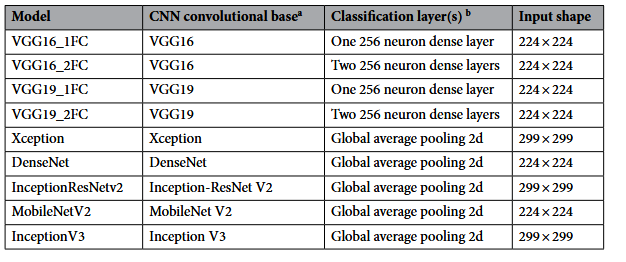

# Literature Review
Approaches or solutions that have been tried before on similar projects.

**Summary of Each Work**:

- **Source 1**: [UDE DIATOMS in the Wild 2024”: a new image dataset of freshwater diatoms for training deep learning models]

  - **[Link](https://academic.oup.com/gigascience/article/doi/10.1093/gigascience/giae087/7912108?login=false)**
  - **Objective**: This paper presents the dataset from which the subset of data I am working with originates. The autors present this dataset to help the community improve the deep learing algorithms that are used in the automated classification of diatom species.
  - **Methods**: Self supervised learning is explored in this paper with the presented dataset.
  - **Outcomes**: In general the results of the ML were not as good as previously achived with other datasets. This is due to the background of the images having debris and in some cases other diatoms in them. But this is also how the images look in the real world thus it is good to use these images.
  - **Relation to the Project**: Descibes in detail my dataset and gives a lot of backfround information also refering to othe papers and dataset. these privide valuable information sources.

- **Source 2**: [Deep learning diatom taxonomy based on virtual slides]

  - **[Link](https://www.nature.com/articles/s41598-020-71165-w)**
  - **Objective**: The authors discuss how well different CNN architectures perform when faced with the task of identifying diatom species. They also investigate how the size of the training data has an impact on the performance of the model, and how well a model trained on one dataset (here they use samples from different research expeditions) does when faced with a new dataset.
  - **Methods**: They tested 9 CCN architectures shown in the following table:
   
  - **Outcomes**: They show that VGG models outperfomr te other architectures when it comes to correctly identifying diatom taxonomy.
  - **Relation to the Project**: This result shows that I sould defently try some VGG architectures when working with my data to see if I can get some good resuts when using them. And look more into the aplication of pre trained model for this kind of task.

- **Source 3**: [DiatomNet: An automatic Diatom genus identification system through microscopic images and Deep Learning]

  - **[Link](https://www.biorxiv.org/content/10.1101/2025.02.10.635050v1.full)**
  - **Objective**: They build an automated tool for diatom recognizion based on a public database and a CNN network. Completely with data processing pipeline.
  - **Methods**: They build a database featuring 44 classes of diatoms in 10 650 images. As the classes are highly unbalanced in the number of images available in the classes agumentation is used in classes with few images to balance out this fact.
  - **Outcomes**: They build the automated tool that is publically available. They showed, that CNNs learned better when trained from scratch then when transfer learing is uesd with this dataset.
  - **Relation to the Project**: Here data agumentation in relation to diatom images is discussed and described. This could be quite helpfull in my project to see what has been done or what I could try with my dataset. Also it could be interesting to see if some images my model does not regognize correctely will be regognized by the automated tool.
