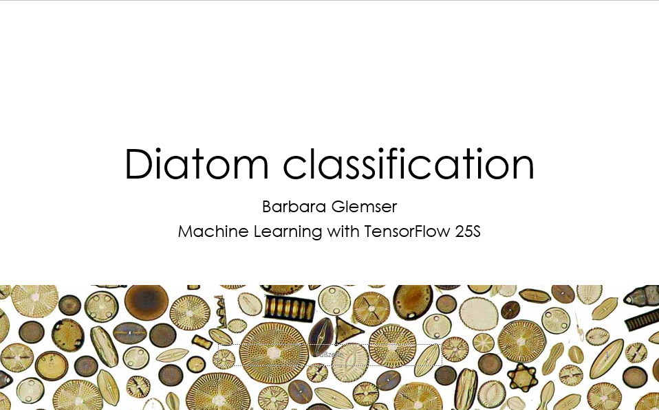

# Automated diatom species regognizion

## Repository Link

https://github.com/bglemser/Diatom

## Description

Diatoms are microalge that can be found in the oceans as well as in fesh water bodies all over the world. Their unique feature is a cell wall made of silica called frustule. These frustules mounted on microscopic slides are also used to identify the species of the diatom. This however is not as simple as it might sound due to several reasons. One is the high number of diatom species, that make manual annotation challenging and an absolut expert job, leading to a limited amount of datasets available. Another aspect is the fact that the frustules of different species are highly similar and differing only in few features. 
Diatoms are however one of the key species in phytoplankton communities and are of high importance in sveral research areas. Thus automated species identification is an important tool. In this project I am using a subset of a large dataset to train a neural network to correctely classify diatom species. 
The subset is from the followig dataset:
Venkataramanan, Kloster, Burfeid-Castellanos et al. (2024): “UDE DIATOMS in the Wild 2024”: An new image dataset of freshwater diatoms for training deep learning models.

The subset itself can be found on here:
https://www.kaggle.com/datasets/michaelkloster/ude-diatoms-in-the-wild-2024/data

### Task Type

Image Classification

### Results Summary

- **Best Model:** [MobileNetV2]
- **Evaluation Metric:** [Accuracy, F1-Score, MS]
- **Result:** [Accuracy = 0.48, F1-score = 0.50]
## Documentation

1. **[Literature Review](0_LiteratureReview/README.md)**
2. **[Dataset Characteristics](1_DatasetCharacteristics/data_exploration.ipynb)**
3. **[Baseline Model](2_BaselineModel/BaselineModel.ipynb)**
4. **[Model Definition and Evaluation](3_Model/model_definition_evaluation)**
5. **[Presentation](4_Presentation/README.md)**

## Cover Image

